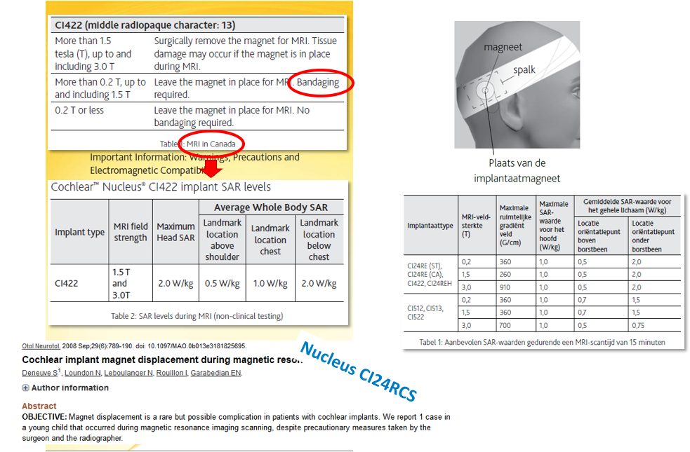

# Cochlear Implant

## Part 2

**Attention:** Make sure the information you found concerns the exact brand, type and version as the device you are examining. 
Also check it is the most recent information sheet.

If all went well you found several documents about this implant.

**Question:** Above you find the information for Canada (left) and The Netherlands (right)
Suppose you work in The Netherlands, what would be your advice?

 
 

[Advice](advies.md)
