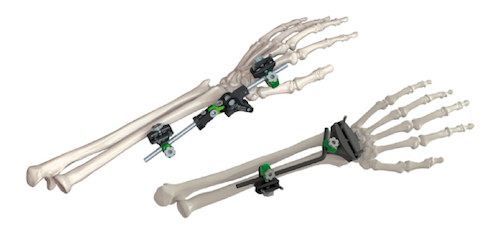
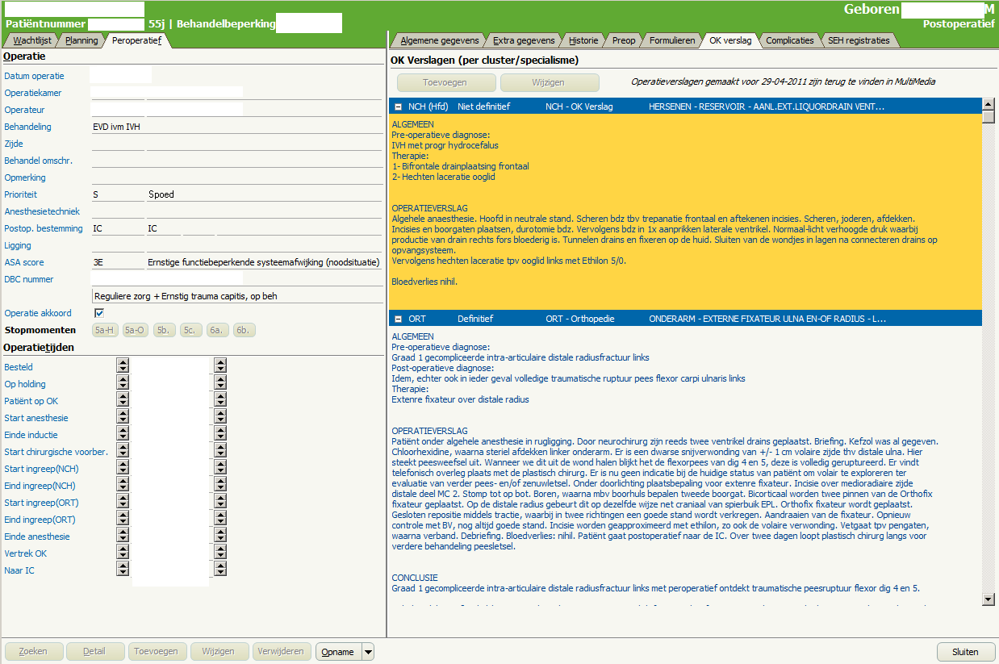
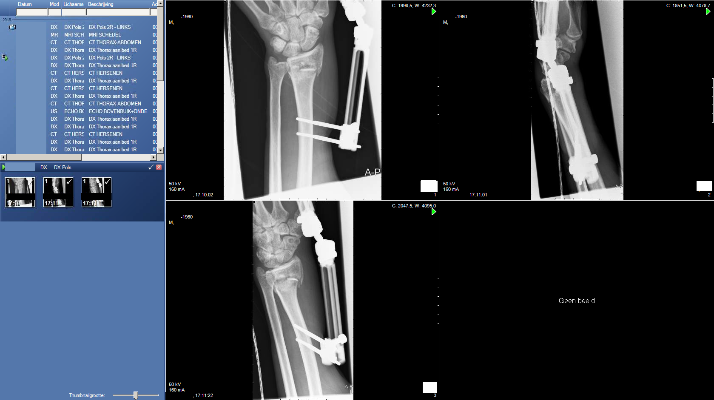

# External Fixator 

## Introduction

For treatment of complex wrist fractures sometimes an *external fixator* is used.
To the right you see an example of such a device, made by the
fabrikant [Orthofix](http://www.orthofix.com). **Aanvraag:** Patiënt is een man (55 jaar) die ruim een maand geleden van een
ladder is gevallen.  Binnengebracht met de ambulance. Nu wordt gevraagd een
MRI Brein, inclusief FLAIR, DWI en een susceptibility gewogen sequentie. 

 

**Extra informatie:** hieronder vind je de aanvraag en Röntgen-opnamen van de pols.

 
 

**Vraag:** Zoek uit of deze patiënt gescand zou kunnnen worden en zo ja, onder welke voorwaarden.

 
 

[Vervolg](case_part2.md)
