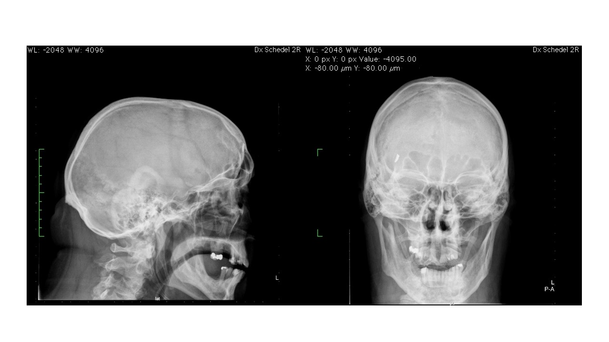

# Metal fragment

In this case the researchers decide to go with the statement that all fragments were removed 
and the patient is accepted for MRI. When the patient is being positioned on the MRI bed he notices 
a tugging feeling in his forehead. He is then asked to get off the table, guided out of the MRI suite and 
referred for an X-ray of the head:

 
 

**Question:** What would you do next?

 

[Continue](case_part3.md)
