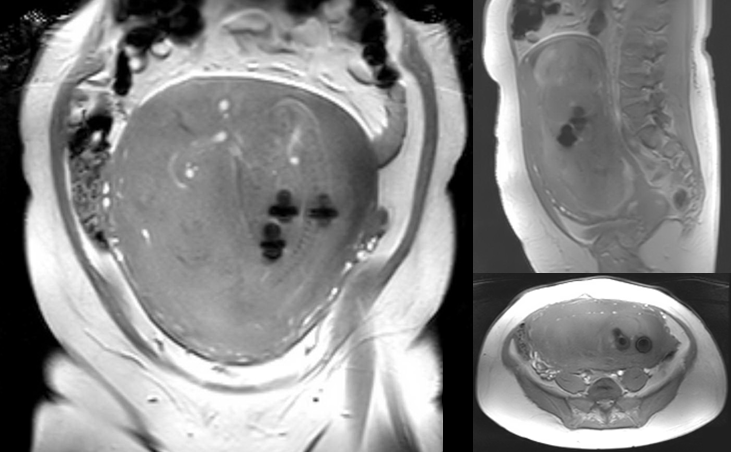

# Gravida with a surprise

## Introduction

You are called by the MRI techs. They have a pregnant lady in the scanner to make a scan of the fetus.
On the scout/survey they see four artifacts and they wonder whether mother and child can be scanned safely.

**Question:** What is your first response? Can they safely scan mother and child? 

 
 

[Continue](case_part2.md)

