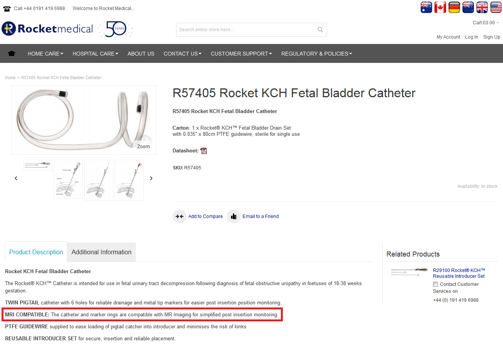
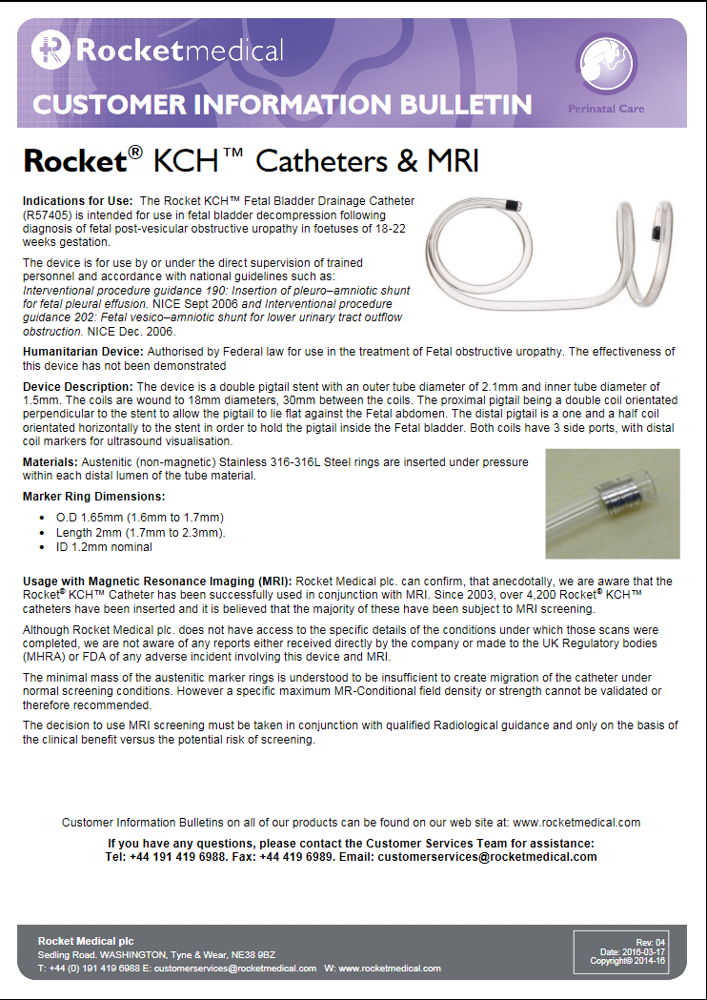

# Gravida with a surprise

## Information from the manufacturer.

You have probably found information at various places on the ** Rocket ** Medical MRI safety website, but it is not easy to say quickly whether it is safe to scan.
Please see our comments below on interpreting the information provided.

 
 
 

**Hint:**
Via *Hospital Care / Delivery Suite - Labour Ward / Rocket CVS Needles & KCH™ Fetal Bladder/Pleural Catheters* you'll find 
under *Product Description* and also in the *datasheet* that the catheter is 'MRI Compatible'.  

**Attention:** 
The designation * MR-compatible * is not unambiguous, can scanning be done safely or is it only possible under special conditions?  
For this reason, the terms ** MR-safe, MR-conditional ** and ** MR-unsafe ** are used today.

 
 

**Hint:**
Via *Customer Support / Customer Information Bulletins* you'll find the 'Use of Rocket® KCH™ Catheters with MRI - ADVISORY BULLETIN'.
 

 
 
 
**Question:** what is your advice?

 
 

[Continue](advies.md)
