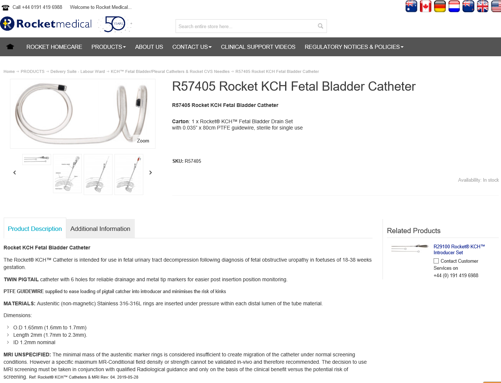

# Gravida with a surprise

## Information from the manufacturer.

You have probably found information at various places on the ** Rocket ** Medical MRI safety website, but it is not straight forward to say whether it is safe to scan. 
Please take note of what the Product Description says about the materials applied and how to deal with MRI-safety.

 

Via *Products / Delivery Suite - Labour Ward / KCH™ Fetal Bladder, Pleural Catheters & Rocket CVS Needles/ R57405 Rocket KCH Fetal Bladder Catheter * you'll find 
under *Learn More* the product description that tells you the catheter is 'MRI UNSPECIFIED'.  

**Attention:** The designation * MR UNSPECIFIED * only helps in the sense that we now know we are not dealing with the internationally accepted classification
 ** MR-safe, MR-conditional ** and ** MR-unsafe **.

 
 
 

**Question:** what is your advice?

 
 
 
 
 
 
 

**Hint:**
There's different types of stainless steel and not all of those are MRI-Safe. If you want to learn more about (Austenitic) stainless steel 
you may want to look {here}(https://en.wikipedia.org/wiki/Stainless_steel#Austenitic_stainless_steel) 
 

[Continue](advies.md)
