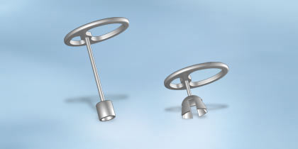

# Ossicular Chain Reconstruction

## Introduction

**Medical request:** Patient (female, age 58, no other contra indications) underwent
an operation on her middle ear in 2006. Requested MRI examination is a 3T scan of the brain.



<br>
 
Below you find the operation report:
<br>
```
Pre-operatieve diagnosis :
Post-operatieve diagnosis :
Therapy : Ossicular Chain Reconstruction, radical left
Anesthesia: general

Patient is positioned. Sterile covering, working through the ear canal. Dr. A. begins with Dr. B. 
shearing tympanomeatal flap. Inspection of neo middle ear. The previous Kurs prosthesis 4.25 seems too long, 
it penetrated through the eardrum. Footplate inspection reveals questionable footplate mobility. 
From tragus cartilage two pieces of cartilage are placed in the oval window niche. One piece was unsuccessful 
due to a fracture of the piece.
Inspection, a shorter Kurs prosthesis seems better. Dr. C. takes over from Dr. A. 
Using the fitting prostheses the Kurs 3.0 seems to be a better size. 
This is placed between the cartilage pieces and the oval window niche. Cartilage is then cut, and placed on the prosthesis. 
The prosthesis appears to tilt slightly posteriorly. It is shifted to anterior as far as possible. 
Using gel foam, the prosthesis is fixed slightly anteriorly. The fascia flap is then placed under the 
eardrum and the eardrum with gel foam is folded back. Tampon placed. Band Aid. Bandage. 
```

<br>
<br>

**Question:** Can this patient be scanned safely and and if applicable, under what conditions?

<br>
<br>

[Continue](case_part2.md)
