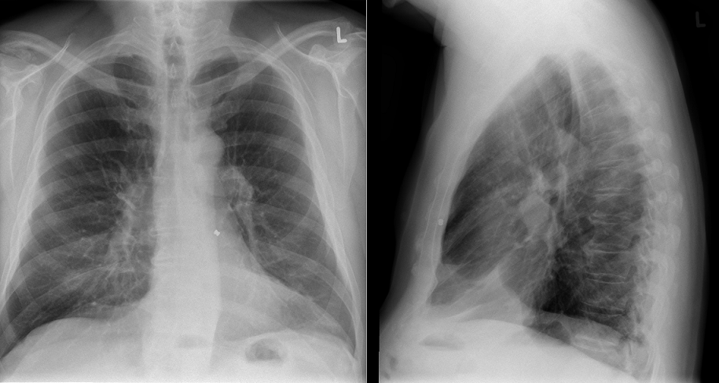

# Airgun Pellet

## Introduction

You are confronted with a question from a colleague from another hospital.
It's about a patient (male, age 65) who wants to participate in a scientific study involving an MRI scan.
What raised concern is that this patient already 20 years carries an airgun pallet in his chest as a result of a brotherly row.

De patiënt heeft verder geen contra-indicaties.  De artsen die verbonden zijn
aan de studie zouden deze patiënt graag willen includeren. Het gaat hierbij om
een gecombineerd onderzoek van het hoofd en het hart op een 1.5T MRI-scanner.

 

**Vraag:** Er is verder geen informatie beschikbaar over de patiënt. Wat is je advies?

 
 

[Advies](advies.md)
