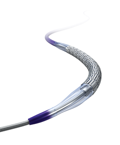

# Stent 1

## Extra information

When you do an internet search for *Omnilink Abbott* one of the first hits takes you to the manufacturer's site: https://www.cardiovascular.abbott/us/en/hcp/products/peripheral-intervention/omnilink-elite-vascular-balloon-expandable-stent-system.html.
 As in many other cases the web address may help to clarify type or application of a device. In this case the term *peripheral-intervention* should raise a flag.
 
 
 

**Attention:** Always be sharp on the quality of the input information, it may be incomplete or distorted. The latter holds especially true when 
interpretations or assumptions are made by all people involved, ourselves included.

 
 
 
 
___

 

**Question:** Do you now have adequate information to decide whether this patient can be safely scanned?
Did you find any restrictions or MRI-safety conditions?

 
 

[Continue](case_part3.md)
