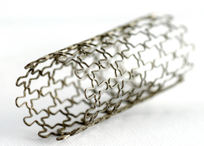
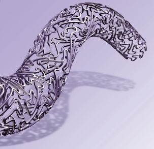
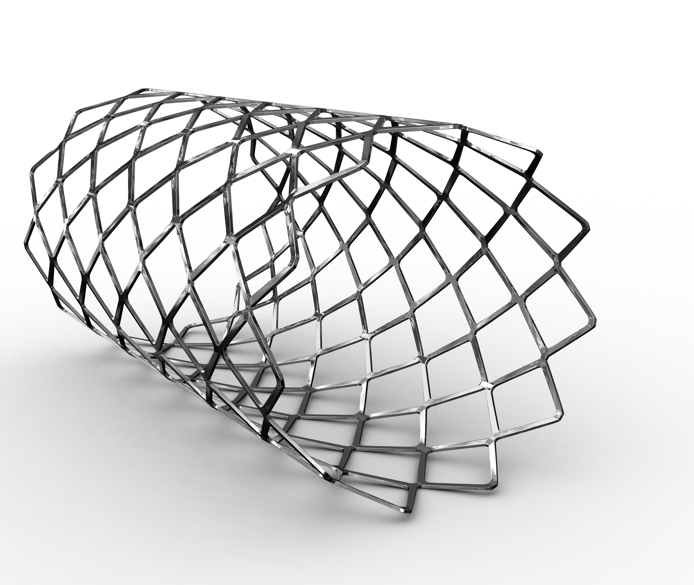

# Stent 2

  

## Introduction

An MRI Brain on 3T is requested. The patient has two coronary stents, 
both interventions were performed in 2014. The patient also has a hip prosthesis that was placed in 2010.

 
 

**Question:** Is this sufficient information to decide whether this patient can be safely scanned and 
if applicable, under what conditions?

 
 
[Continue](case_part2.md)
