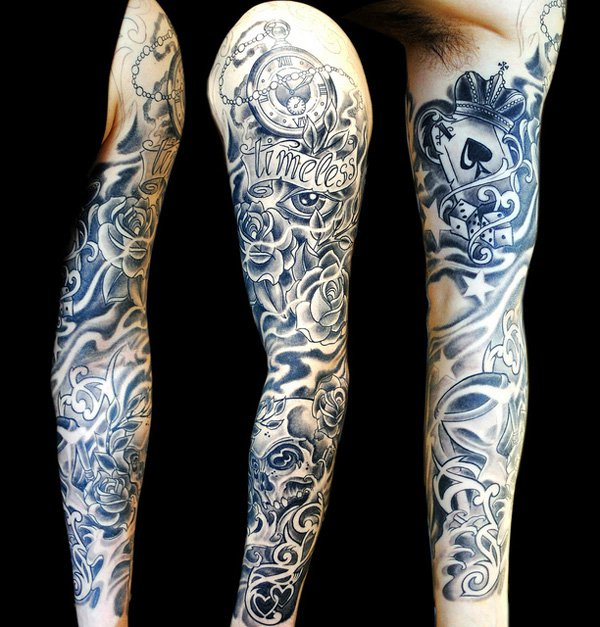

# Gezonde vrijwilliger 1

## Introduction

A 30 year old woman wants to participate in a scientific study as a 
healthy control. It's all about a 3T functional MRI scan of the brain.
The volunteer has a so called sleeve tattoo she got about 1 year before
in a respectable tattoo shop in your home country.

 

**Question:** Would you allow the volunteer to participate in this study?

 
 

[Continue](case_part2.md)
