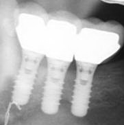

# MRI Safety, case studies

## Introduction

In this training a variaty of MRI safety cases is presented, all taken from
clinical practice. The purpose is to get you aquainted with the process of 
gathering proper information to formulate an underpinned MRI-safety advice
For some cases the required information is readily provided, for other cases you'll need
to visit the iternet to retrieve MRI-safety information, for example from 
[MRISafety.com](http://mrisafety.com), or from the manufacturer's website.
No doubt you will sometimes find this can be quite a pain, similar to what it can be in practice.

 
 
In some cases you may find a surprise. It is not that we want to trap you, it's 
about cases that surprised us to and we experienced as educational. 

The format is simple. Each case starts with an MRI examination request and some additional information.
In some cases the information provided will suffice, in other cases you will need to gather additional 
information from MRI safety- or manufaturer's websites.
It's then up to you to formulate a substantiated advice for the radiologist whether the patient can be scanned
safely (and if required, under what conditions) or not.

The cases are not presented in a specific order. In all cases the learning effect will be maximum 
when you get to the bottom of things before hitting 'Continue'.

Have fun! 

Paul de Bruin & Wouter Teeuwisse

## Cases

1. [Cochlear implant](CochleairImplantaat/case.md)
1. [Stent 1](Stent1/case.md)
1. [Stent 2](Stent2/case.md)
1. [External Fixator](FixateurExterne/case.md)
1. [Healthy Volunteer](Volunteer1/case.md)
1. [Gravida](Gravida/case.md)
1. [Ossicular Chain Reconstruction](Ketenreconstructie/case.md)
1. [Airgun Pellet](Kogel/case.md)
1. [Metal Fragment](Fragment/case.md)
1. [Neurovascular Clip](Clip/case.md)

## Disclaimer

* Comments are most welcome and appreciated, please send those to w.m.teeuwisse@lumc.nl
* These cases are analysed according to local protocol. We present them for training purposes only and not as guidelines.

  