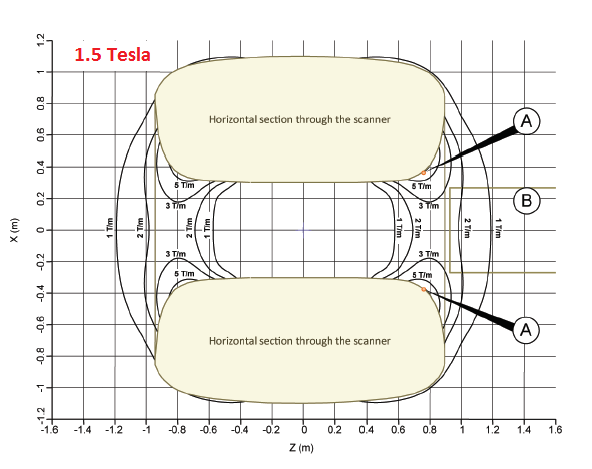
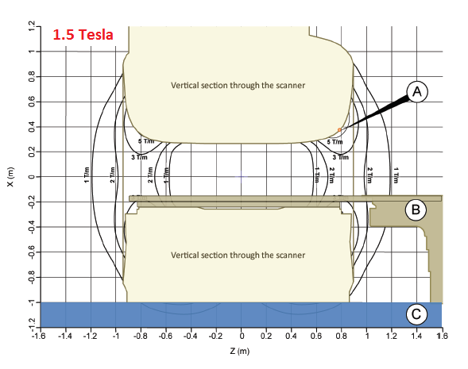
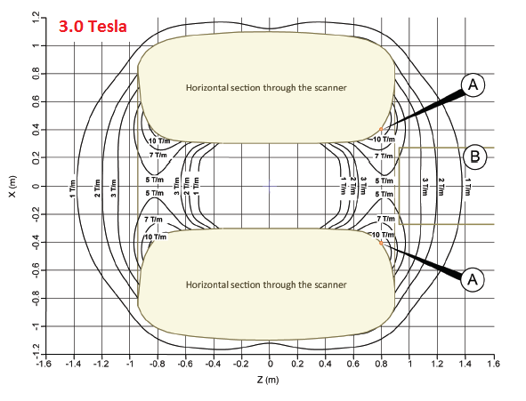
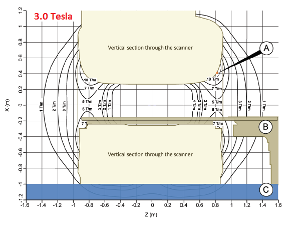

# Technical beackground information  2

## Field strength and frequency

An overview of different gyromagnetic ratios you can find [here](https://en.wikipedia.org/wiki/Gyromagnetic_ratio).
For protons the gyromagnetic ratio is 42.576 MHz/T, giving rise to a resonance frequency of about 64 MHz on a 1.5T, 
128 MHz on a 3T and 298 MHz on a 7T scanner.
 
 

## Wavelength (in vacuum)

| Type of wave     | Typical frequency [Hz]  | Typical wavelength |
|------------------|-------------------------|--------------------|
| Radio            | ~10^8  (100 MHz)        | ~ 3 m              |
| Microwave        | ~10^10 ( 10 GHz)        | ~ 3 cm             |
| Infrared         | ~ 3 * 10^13             | ~10 micro m        |
| Ultraviolet      | ~ 3 * 10^16             | ~10 nm             |
| X-ray            | ~ 3 * 10^18             | ~ 0.1 nm           |
| gamma-ray        | ~ 3 * 10^20             | ~ 1 pm             |

Maximum energy transfer, and with that the chance of a temperature increase, takes place
in objects with lenght = wavelength/2.
 
 

**Attention: In tissue the wavelength can be considerably reduced due to dielectrical effects.
To get an impression of the wavelength in tissue for different field strengths one can, 
for example, use the [Tissue property calculator](http://niremf.ifac.cnr.it/tissprop/htmlclie/htmlclie.php): under ALL TISSUES, SINGLE FREQUENCY enter the correct frequency and click Go!.**
 
 

## SAR

SAR stands for Specific Absorption Rate and expresses the amount of energy that is absorbed 
each second in a specified amount of tissue. On your scanner you will mostly find SAR in Watts per kilogram or W/kg

According to the norm IEC60601-2-33 ed. 3 (2015-06) SAR limits are defined as follows:

| Averaging time          | 6 minutes                                                         |
|-------------------------|-----------------------|-------------------------|-----------------|
|             Body region | Whole body SAR (W/kg) | Partial body SAR (W/kg) | Head SAR (W/kg) |
| Operating mode          |                       |                         |                 |
| NORMAL                  |  2                    |   2-10                  |  3.2            |
| FIRST LEVEL CONTROLLED  |  4                    |   4-10                  |  3.2            |
| SECOND LEVEL CONTROLLED | >4                    | >(4-10)                 | >3.2            |
 
 

## Temperature limits

According to IEC60601-2-33 ed. 3 (2015-06) the temperature in a patient undergoing an MRI examination is limited to:
 
| Operating mode          | Maximum CORE TEMPERATURE (°C) | Maximum Local tissue temperature (°C) | Rise of CORE TEMPERATURE (°C) |
| ----------------------- | ----------------------------- | ------------------------------------- | --------------------------    |
| NORMAL                  |  39                           |  39                                   |  0.5                          |
| FIRST LEVEL CONTROLLED  |  40                           |  40                                   |  1                            |
| SECOND LEVEL CONTROLLED | >40                           | >40                                   | >1                            |
 
 

## Spatial gradient

In the safety information provided by the implant manufacturer one often finds a limit for the spatial gradient.
This is not referring to the gradient system of the scanner it's about the change of the main magnetic field strength B0 in space:
when moving around or inside the magnet the field strength will be different from location to location. 
Between any two points in space there will be a gradual change (= gradient or Delta B_0) in field strength. 
This gradient is expressed in Tesla per meter (T/m). The magnet pulling force on an object is proportional to
 (B_0) * (Delta B_0) and in the user manual of your scanner you will find maps of both Delta B_0 and B_0.
In stead of the unit T/m one can also find the old unit Gauss per centimeter (G/cm). For conversion: 100 G/cm = 1 T/m.

 
  
Top- and side-view of the main magnetic field spatial gradient of a Philips Ingenia CX 1.5 Tesla MRI-scanner.

 
  
Top- and side-view of the main magnetic field spatial gradient of a Philips Ingenia CX 3.0 Tesla MRI-scanner.

