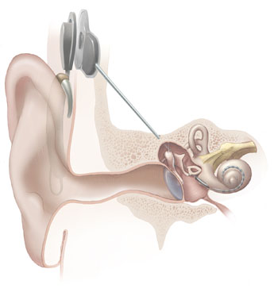

# Cochleair Implantaat

## Inleiding

 Er wordt een 3T brein protocol aangevraagd. 
Van de patiënt is bekend dat zij een Nucleus cochleair implantaat heeft, type CI422.
Zoek op [MRISafety.com](http://www.mrisafety.com), bijvoorbeeld naar
*cochlear nucleus*. 
Zoek ook op internet naar dit implantaat. 


Vraag: Kan dit onderzoek uitgevoerd worden op een 3T MRI-scanner?

```

```

[Vervolg](case_part2.md)

