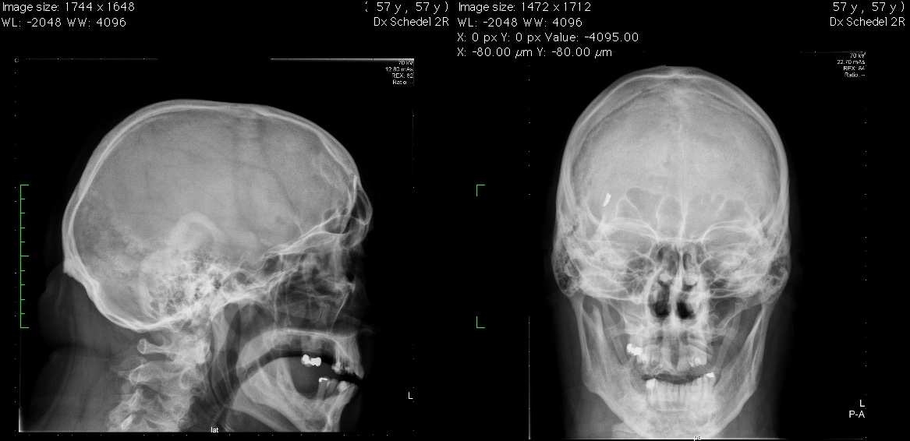

# Metaalfragment

In deze casus werd besloten om de patiënt door te sturen naar de MRI. Bij het 
neerleggen op tafel merkt de patiënt dat er aan iets in zijn voorhoofd wordt
getrokken. De patiënt wordt meteen van tafel gehaald en er wordt een foto gemaakt:

 
 

**Vraag:** Wat doe je?

 
 

[Vervolg](case_part3.md)
