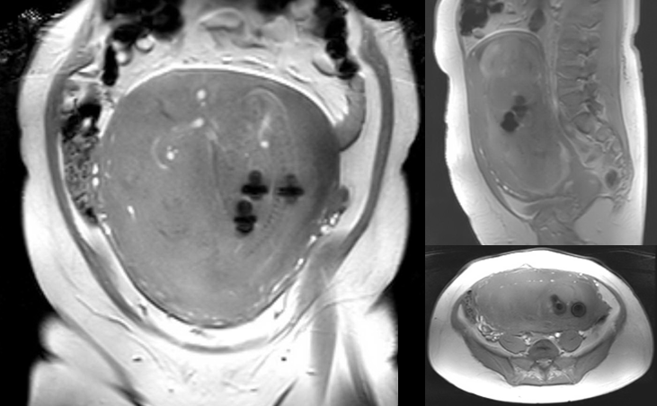

# Gravida scan met verrassing

## Inleiding

Je wordt gebeld door de MRI laboranten. Zij hebben een zwangere mevrouw in de scanner liggen om een scan van de foetus te maken.
Op de scout/survey zien zij een viertal artefacten en zij vragen zich af of moeder en kind wel veilig gescand kunnen worden.


Vraag: Wat is je eerste reactie? Kan deze patiënt gescand worden? 

```

```

[Vervolg](case_part2.md)


