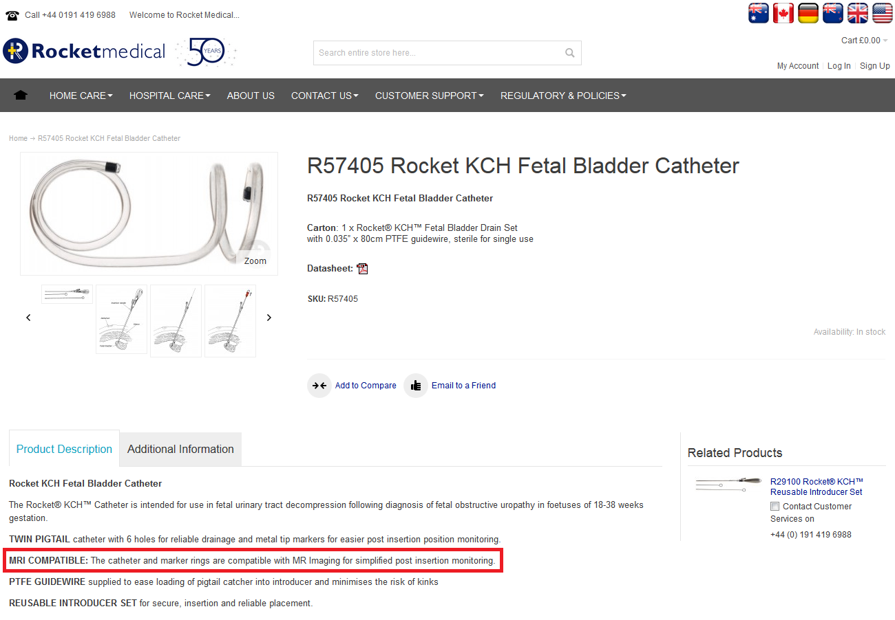

# Gravida scan met verrassing

## Informatie van de fabrikant.


Waarschijnlijk heb je op verschillende plaatsen op de website van **Rocket**Medical MRI-safety informatie gevonden, maar het valt niet mee om op grond daarvan snel te zeggen of er veilig gescand kan worden.
Zie hieronder ons commentaar bij interpretatie van de verstrekte informatie.
<br>
<br>
<br>

Via *Hospital Care / Delivery Suite - Labour Ward / Rocket CVS Needles & KCH™ Fetal Bladder/Pleural Catheters* vind je onder Product Description en ook in de datasheet dat de catheter 'MRI Compatible' is.<br> 
Twee opmerkingen:<br> 
1. *MR-compatible* is niet eenduidig, kan er zonder meer veilig gescand worden of kan dat alleen onder speciale voorwaarden?
2. Welke criteria gelden er in het laatste geval?
 

<br>
<br>
<br>


Via *Customer Support / Customer Information Bulletins* vind je 'Use of Rocket® KCH™ Catheters with MRI - ADVISORY BULLETIN'.
<br>
<br>
<br>
<br>
blabla
 
 
Vraag: wat is jouw advies?


```

```
[Vervolg](advies.md)
