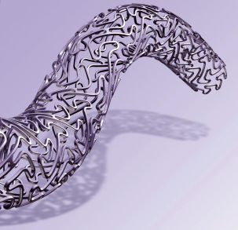

# Coronaire Stent 2

  

## Introductie

**Aanvraag.** MRI Brein op 3T. Patiënt heeft twee stents in de coronairen, 
beiden geplaatst in dit ziekenhuis in 2014. Verder heeft de patient een heupprothese
die in 2010 in een ander ziekenhuis in Nederland geplaatst is.

 
 

**Vraag:** Heb je voldoende informatie om te kunnen beoordelen of de patient
gescand kan worden en zo ja, onder welke voorwaarden?

 
 
[Vervolg](case_part2.md)
