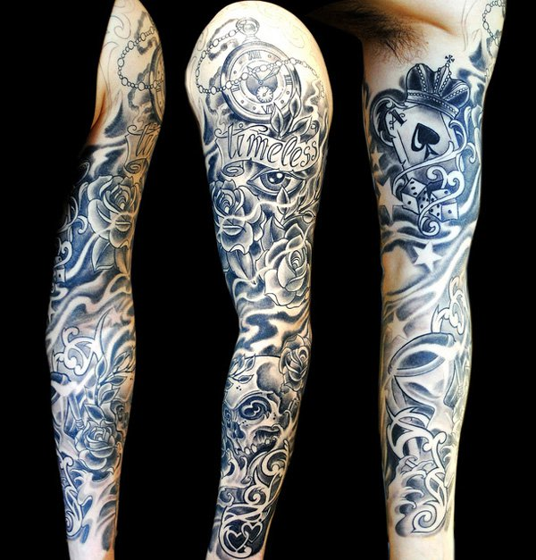

# Gezonde vrijwilliger 1

## Inleiding

Iemand wil meedoen aan een wetenschappelijke MRI studie als gezonde
vrijwilliger (vrouw, 30 jaar). Het gaat om een 3T fMRI-onderzoek van het brein.
De vrijwilliger heeft een zogenaamde *sleeve* tattoo die een jaar geleden is
gezet in een respectabele tattoo-shop in Nederland.

 

**Vraag:** Zou je deze vrijwilliger mee laten doen aan de studie?

 
 

[Vervolg](case_part2.md)
